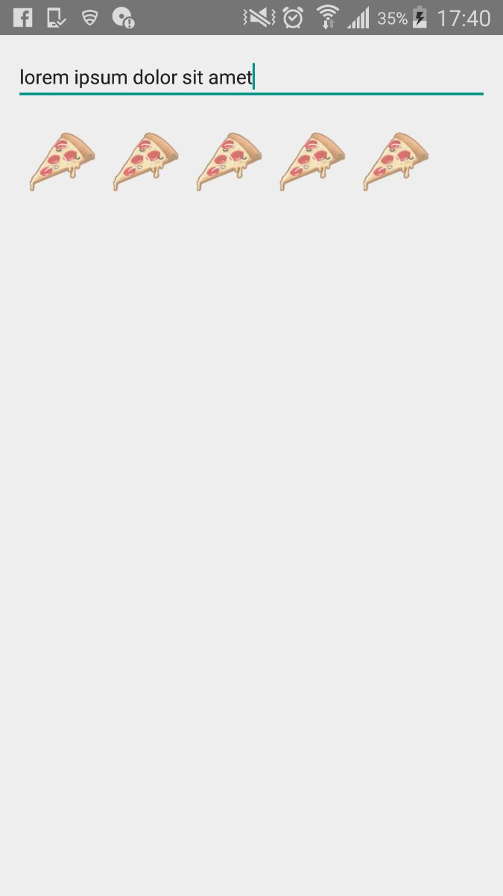

# Ract Native Mobile Apps:

This demo is based on input handling. When user type any word and put space the pizza image will be display against every space.


#Getting Started :

# Testing your React Native Installation :
```
react-native init app-name
cd app-name
react-native run-android
```

# Clone :
```
run npm install
```

>