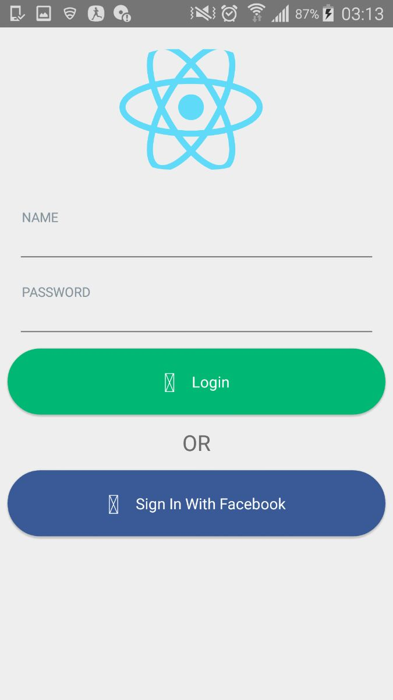

# Ract Native Mobile Apps:

This is simple login UI using  React Native Element. 

More Details:
><a href="https://github.com/react-native-community/react-native-elements">React Native UI Toolkit</a>


#Getting Started :

><a href="https://github.com/react-native-community/react-native-elements">React Native UI Toolkit</a>
https://facebook.github.io/react-native/docs/getting-started.html

# Testing your React Native Installation :
```
react-native init app-name
cd app-name
react-native run-android
```

# Clone app :
```
run npm install
```

>