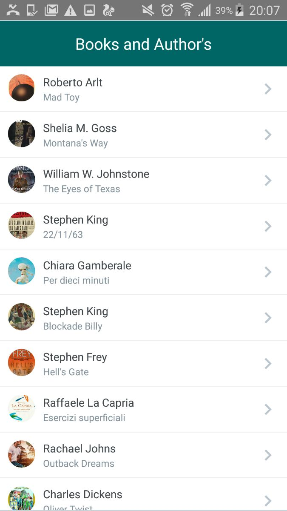

# Ract Native Mobile Apps:

This demo is based on fetch API. In this example we will learn about the fetch api to get 
data from server and display it. We used React Native Elements UI.


#Getting Started :

# Testing your React Native Installation :
```
react-native init app-name
cd app-name
react-native run-android
```

# Clone :
```
run npm install
```
#React Native UI
https://github.com/react-native-community/react-native-elements

>