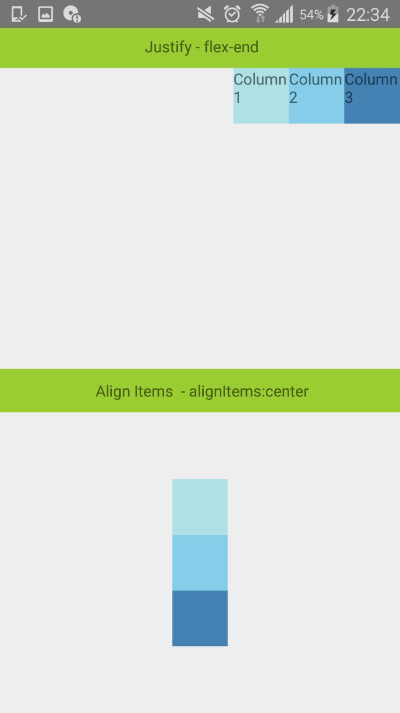
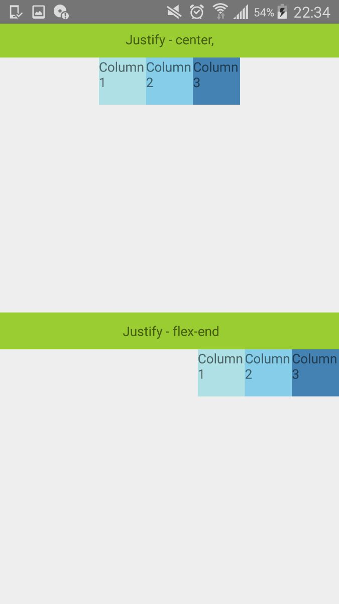
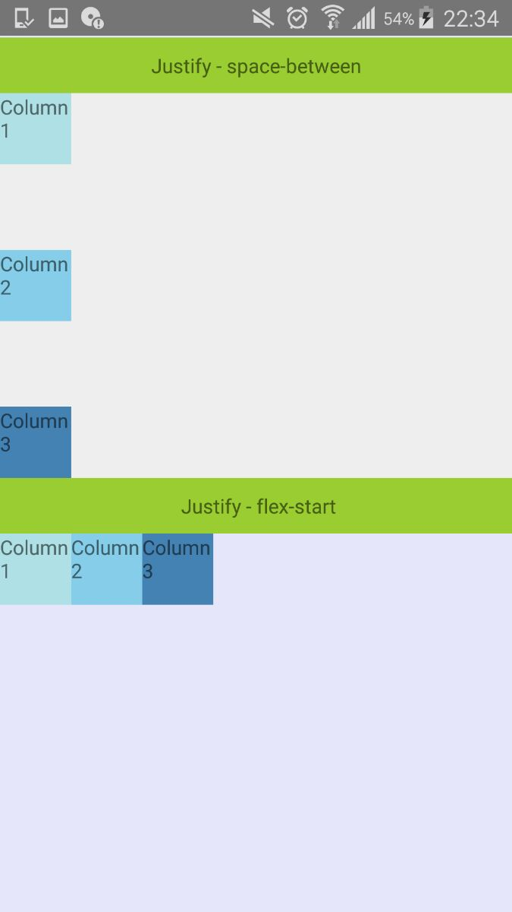
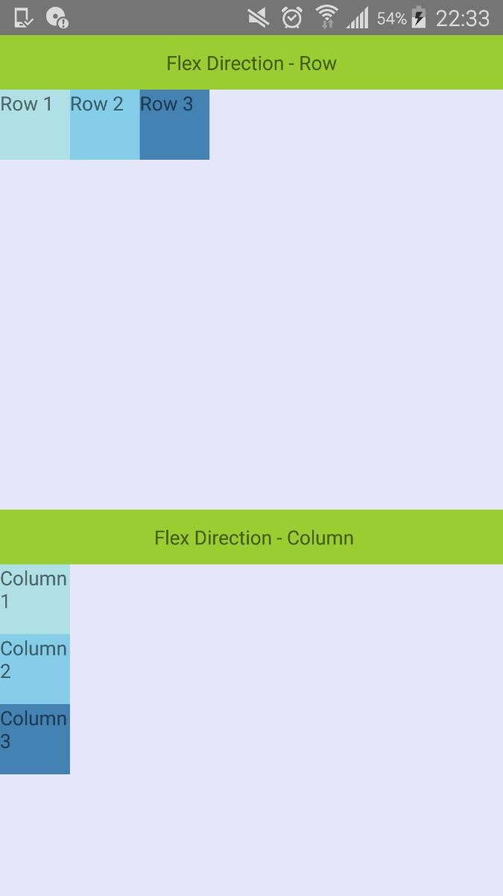

# Ract Native Mobile Apps:

This demo is based on Layout with flex dimentions.  Use flex in a component's style to have the component expand and shrink dynamically based on available space. 
A component can only expand to fill available space if its parent has dimensions greater than 0.


#Getting Started :

# Testing your React Native Installation :
```
react-native init app-name
cd app-name
react-native run-android
```

# Clone :
```
run npm install
```

>