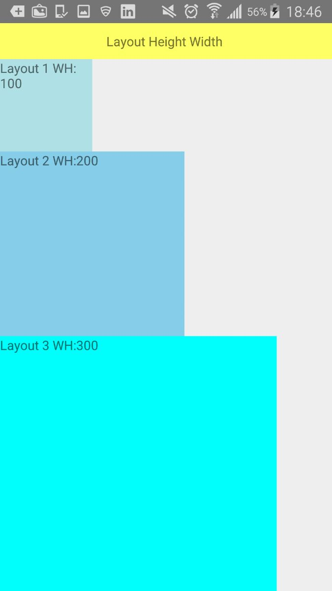

# Ract Native Mobile Apps:

This demo is based on Layout width height. 


#Getting Started :

https://facebook.github.io/react-native/docs/getting-started.html

# Testing your React Native Installation :
```
react-native init app-name
cd app-name
react-native run-android
```

# Clone :
```
run npm install
```

>